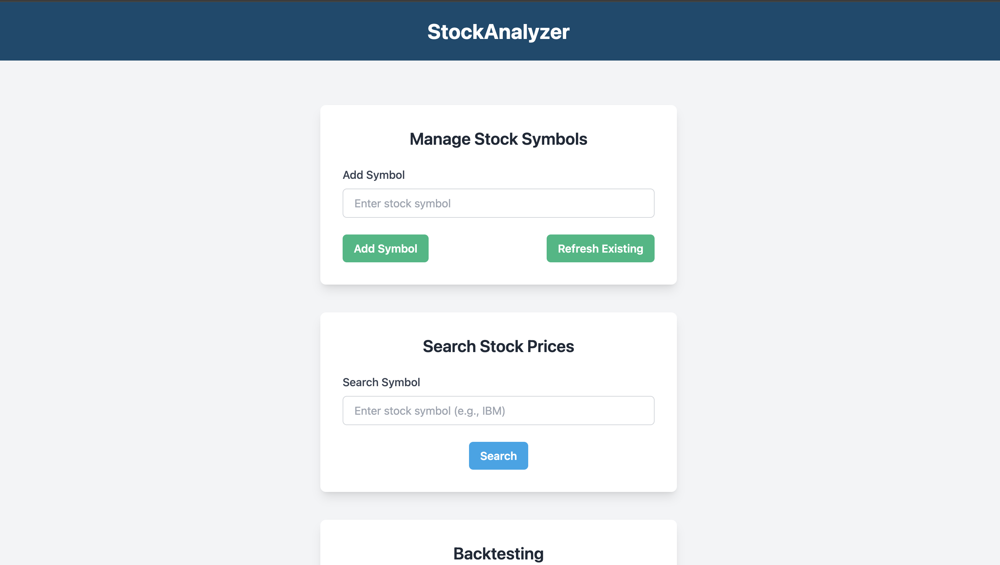

# Financial Data Analysis Platform

## Overview

This Django application serves as a comprehensive financial data analysis platform. It offers functionalities for fetching and analyzing stock data, backtesting trading strategies, and leveraging machine learning for price predictions.

## Features

- Historical stock data retrieval from Alpha Vantage API
- PostgreSQL database for data storage
- Backtesting of simple buy/sell strategies
- Integration of a pre-trained machine learning model for stock price prediction
- Comprehensive report generation
- Deployed on Google Cloud Run
- Dockerfile included for easy deployment

## Prerequisites

- Python 3.x
- pip
- git
- Docker

## Installation

1. Clone the repository:

   ```bash
   git clone [https://github.com/1611Dhruv/stock_analyzer](https://github.com/1611Dhruv/stock_analyzer)
   ```

2. Set up the environment variables:
   Create a `.env` file in the project root with the following contents:

   ```
   ALPHA_VANTAGE_API_KEY=[your_api_key]
   DB_URL=[your_psql_database_url]
   DB_USER=[your_psql_username]
   DB_PASSWORD=[your_psql_password]
   ```

3. Install dependencies:
   ```bash
   python3 -m venv .venv
   source .venv/bin/activate
   pip install -r requirements.txt
   ```

## Database Schema

The database schema consists of two tables:

1. **Symbol Table**: Stores stock symbols.
2. **Financial Data Table**: Stores financial data with `symbol` as a foreign key. There is an index built on the financial data, ensuring that data is always ordered by date. Retrievals are optimized with no sorting costs due to fixed ordering of `symbol` followed by `date`.

## Machine Learning

The ML predictions are stored similarly to financial data. If the user specifies `format=pdf`, the predicted prices are returned as a Matplotlib-generated PDF and stored in the database.

## Running the Application

Start the development server:

```bash
python manage.py runserver
```

## API Endpoints

### Financial Data

- `POST /financial_data/add`

  - Add a new stock symbol
  - Expects `symbol` in the request body

- `POST /financial_data/refresh`

  - Refresh data for existing symbols

- `GET /financial_data/data`

  - List available symbols

- `GET /financial_data/data?symbol=<symbol>`
  - Get data for a specific symbol

### Backtesting

- `GET /backtesting?format=<pdf|json>&symbol=<symbol>&winsell=<sell_threshold>&winbuy=<buy_threshold>&amt=<initial_amt>`
  - Perform backtesting with specified parameters

### AI Prediction

- `GET /ai_prediction?symbol=<symbol>&format=<pdf|json>`
  - Get predicted prices for a symbol. If `format=pdf`, the predictions are returned as a PDF and stored in the database.

### Reporting

- Access the reporting interface at `/reporting/`. This provides a user-friendly UI to interact with the various endpoints.
  Here are some views available:
  
  
  

## Deployment

### Docker

A `Dockerfile` is attached for easy deployment. Before running the Docker container, ensure the following environment variables are set:

- `ALPHA_VANTAGE_API_KEY`: Key to interact with the API
- `DB_HOST`: PostgreSQL database host
- `DB_PORT`: PostgreSQL database port
- `DB_NAME`: PostgreSQL database name
- `DB_USER`: PostgreSQL username
- `DB_PASSWORD`: PostgreSQL password
- `ALLOWED_HOST`: Django specifications for allowed hosts (for CSRF tokens)
- `DEBUG`: Django debug mode (set to `True` or `False`)

To build and run the Docker container:

```bash
docker build -t financial-data-analysis-app .
docker run -p 8000:8000 --env-file .env financial-data-analysis-app
```

### Deployment

The platform is currently deployed on Google Cloud Run. You can access the site at [this link](https://stock-analyzer-949436389006.us-central1.run.app).

The open-source repository is available at [https://github.com/1611Dhruv/stock_analyzer](https://github.com/1611Dhruv/stock_analyzer).
